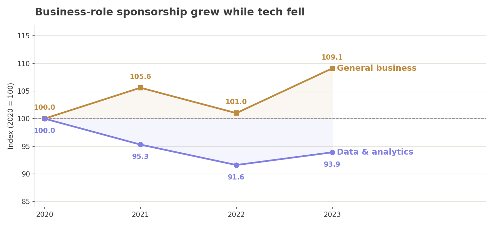
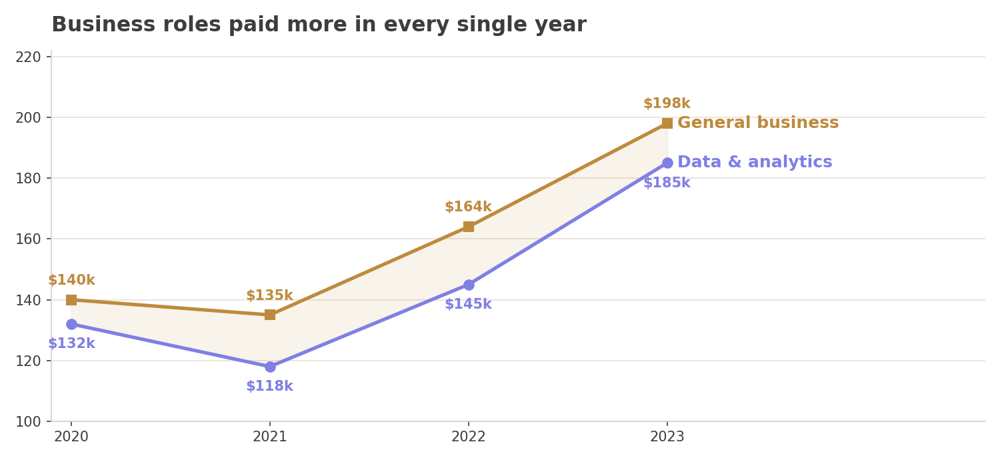
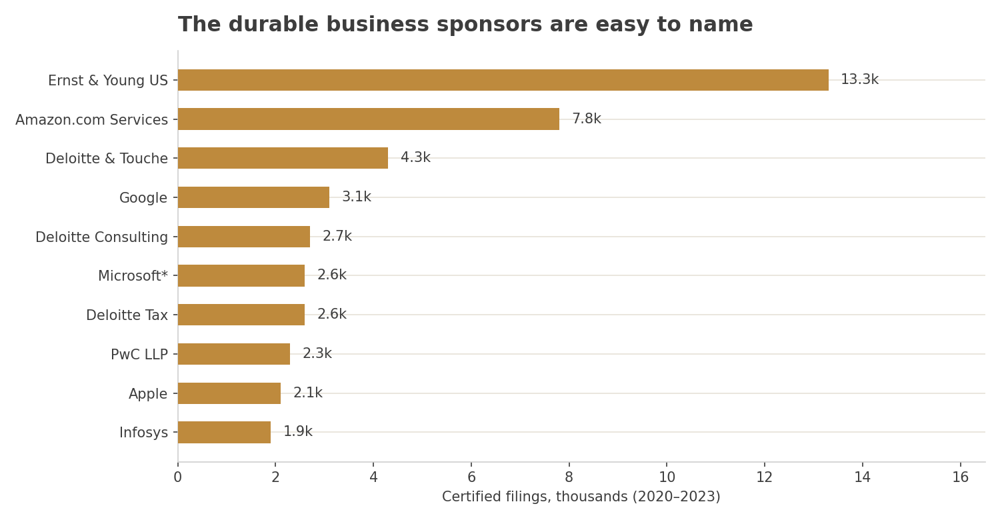
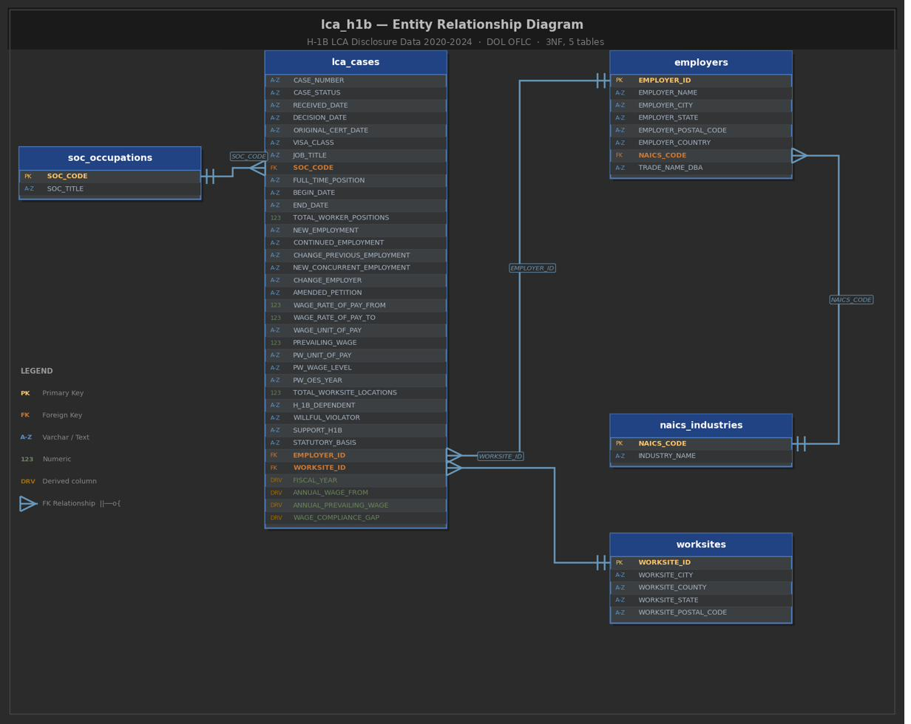

# Which employers reliably sponsor H-1B, and does the role type matter?

A SQL analysis of 3.47 million H-1B labor condition applications, 2020 to 2023, comparing business roles with data and analytics roles on sponsorship volume, approval, pay and employer durability.

## Overview

International candidates usually pick a career track first and ask about visa sponsorship later. I wanted to test that order. If you are choosing between a business role and a data and analytics role, does one path carry more sponsorship risk, and which employers keep sponsoring year after year rather than filing once?

I used the Department of Labor's public H-1B disclosure data, a full record of every labor condition application employers filed. I split the 96-column flat file into a five-table MySQL database, then wrote eight queries covering volume, approval, denial, wages, industry, employer durability and robustness checks.

The short answer: the approval odds at this stage are nearly the same for both tracks. What differs is the size of the market, the pay, and how open each track is to entry-level hires.

## Key findings

**Approval risk is not the deciding factor.** Business roles certified at 91 to 94 percent each year, data and analytics roles at 91 to 95 percent. The gap never passed 1.7 points.

**The business-role market is smaller but grew.** Data and analytics filings run about six times higher, near 470,000 a year, but fell 6.1 percent from 2020 to 2023. Business-role filings rose 9.1 percent over the same years.



**Business roles pay more on average — but the premium is narrower than it looks.** Certified business-role filings offered about $8,000 to $19,500 more per year on average than data and analytics filings across 2020 to 2023, and the gap survives on medians ($9,900 to $15,100). But one-fifth of the business group is IT managers (SOC 11-3021), who average $191,679. Take them out and the median premium flips: the typical non-IT business filing pays about $3,000 less than the typical data filing. The premium is real, but it lives in the upper tail, not the middle. See `sql/08_robustness_checks.sql`.


*Mean premium including IT managers (SOC 11-3021); the median and ex-IT-manager checks are in `sql/08`.*

**Business roles are more open at entry level.** 19.6 percent of certified business-role filings were at prevailing wage Level I, against 8.7 percent for data and analytics.

**Durable business sponsors are few and concentrated.** Only 77 employers filed 200 or more business-role applications in every year from 2020 to 2023, against 619 for data and analytics. EY leads the business list with 13,329 certified filings and a 97.8 percent certification rate.



**Volume can mislead.** The largest data and analytics filers are IT staffing and consulting firms, which sponsor placements rather than direct hires. I also found a cluster of generic-named LLCs with hundreds of filings and almost none certified, a pattern worth referring for fraud review.

## What this means

For a candidate choosing a track, the approval rate at this stage should not drive the choice. Market size, pay, entry-level access and employer durability should. Data and analytics roles usually line up with STEM-designated degrees, which can qualify for the 24-month STEM OPT extension and more lottery attempts. That eligibility depends on the degree, not the job code, so check your own program.

## Data

| Source | What it is | Size |
|---|---|---|
| [DOL OFLC LCA disclosure data](https://www.dol.gov/agencies/eta/foreign-labor/performance), via [Kaggle](https://www.kaggle.com/datasets/zongaobian/h1b-lca-disclosure-data-2020-2024) | Every labor condition application filed, 2020 to 2024 | about 3.5 million rows, 96 columns |
| [US Census Bureau 2022 NAICS codes](https://www.census.gov/naics/2022NAICS/6-digit_2022_Codes.xlsx) | Official industry names for employer codes | 1,012 rows |

The raw files are too large for GitHub. See [data/README.md](data/README.md).

## Method

- Split the flat file into five tables in third normal form: `lca_cases`, `employers`, `worksites`, `soc_occupations`, `naics_industries`. See [docs/methodology.md](docs/methodology.md) and the ERD below.
- Fixed six cleaning rules before running anything: H-1B only, every case status kept, identical rows kept, wages annualized, a wage compliance gap column, and calendar year from the received date.
- Grouped roles by Standard Occupational Classification major group: 11 and 13 as business, 15 as data and analytics.
- Queried with CTEs, conditional aggregation, `RANK()`, `LAG()` and `ROW_NUMBER()`, a minimum-volume threshold for denial rates, and a four-year continuity rule for durable sponsors.
- Kept 2020 to 2023 as the analysis window. The 2024 file covers only part of the year.



## What went wrong along the way

- The prevailing wage level column stores bare Roman numerals, not "Level I" strings. My first wage-level query returned zeros until a diagnostic query showed the real values.
- A `LIMIT` clause in the durable-sponsor query silently dropped one role group from the results.
- Some raw SOC codes are malformed, stored as dates or text, so the code column had to be widened before import.

## Limitations

- LCA certification is a Department of Labor step. It is not USCIS petition approval and says nothing about lottery odds.
- Averages are used in the main queries. A median check is in `sql/08_robustness_checks.sql`.
- Legal entities are not merged to parent companies. Deloitte, PwC and HCL appear several times.
- 28.7 percent of employers have NAICS codes with no six-digit Census match. They are kept and reported, not dropped.
- SOC coding is inconsistent for business roles, so that market is likely undercounted.

## Responsible use

This data exists so wage compliance can be checked. Uses that support workers and accountability are fine. Rankings that hide how they work, competitor surveillance and anything that could identify individuals are not. See [docs/data-ethics.md](docs/data-ethics.md).

## Repository structure

```
data/      source links and notes
docs/      methodology and data ethics
sql/       the eight analysis queries, including robustness checks
visuals/   charts, ERD, schema and query result screenshots
```

## How to reproduce

1. Download the source files listed in [data/README.md](data/README.md).
2. Load them into MySQL 8 (I used DBeaver) and build the five tables shown in the diagram, following the steps in [docs/methodology.md](docs/methodology.md). Table layouts are in `visuals/schema/`.
3. Run the queries in `sql/` in order, `01` to `08`.

**Tools:** MySQL 8, DBeaver

## Next steps

- Extend the median robustness check in `sql/08` to the remaining queries.
- Build the Python ETL pipeline (`etl/`) and table-creation script (`sql/00_create_tables.sql`) so the build is reproducible end to end.
- Merge legal entities to parent companies.
- Add USCIS petition outcomes to move from LCA certification to actual approval.
