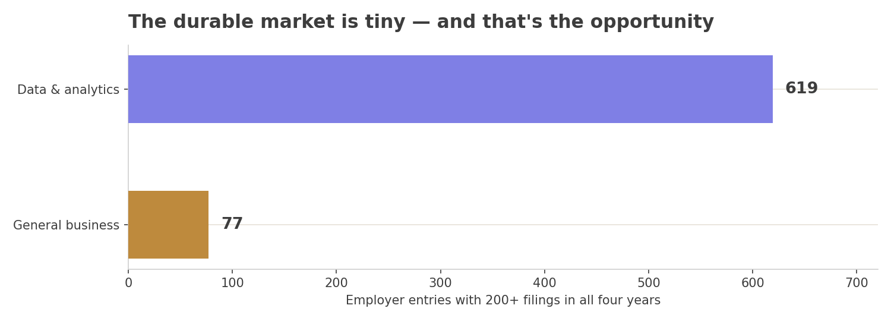
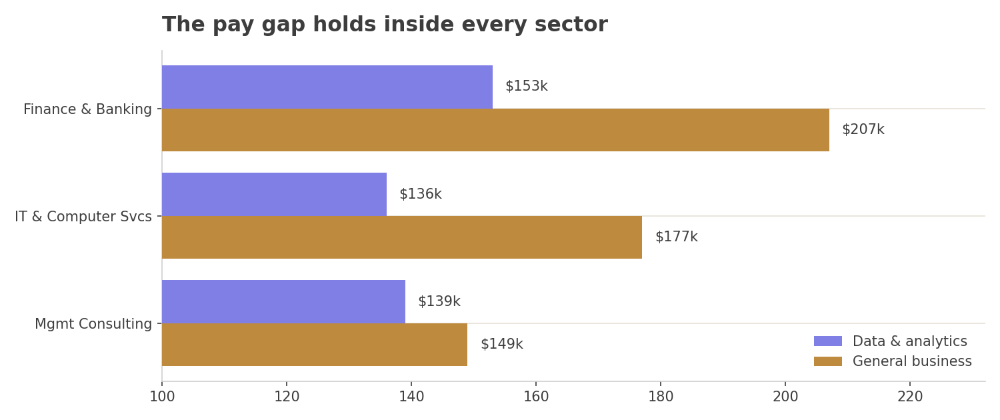

# Which Employers Reliably Sponsor H-1B Business Roles

A SQL analysis of 3.47 million U.S. H-1B filings (2020-2023) comparing general business roles with data and analytics roles, and narrowing the market down to a short list of employers that sponsor every year.

*Certified filing volume indexed to 2020. Business-role sponsorship grew through the period while tech-role sponsorship never got back to its 2020 level.*

## Context

The common view is that H-1B sponsorship is mostly a tech thing, so international candidates aiming for business roles are at a disadvantage. The public data to test that exists, but it sits in a flat government file with 96 columns and millions of rows. Nobody can answer "which employers will actually sponsor a business role, year after year" by scrolling through it.

## Approach

I rebuilt the Department of Labor disclosure file as a five-table relational database in MySQL and wrote seven SQL queries that compare the two role groups on approval odds, trajectory, pay and employer durability.

## Result

- **Approval risk is not the difference.** Certification rates for business and data roles never differed by more than 1.7 points in any year.
- **Business-role sponsorship is growing.** Volume rose 9.1% from 2020 to 2023 while data and analytics fell 6.1%.
- **Business roles pay more, and the gap is structural.** It holds inside each of the three biggest sectors (finance, IT services, consulting), so it is not just a side effect of business roles clustering in high-paying industries. Healthcare is the one sector where it flips.
- **The durable market is small and easy to name.** Only 77 business-role employer entries filed in all four years with 200+ filings, compared with 619 for data and analytics. That makes a realistic target list.

*Employer entries with 200+ filings in all four years. The business-role durable market is a fraction of the tech one, which is exactly why a target list is practical.*

**Recommendation:** focus outreach on the employers that sponsor both business and technical roles every year (EY, Deloitte, Amazon, Microsoft, Google, PwC, Apple), and put finance and management consulting first. Universities pay the least and certify the least in both groups.

*Top 10 business-role sponsors that filed in all four years with at least 200 filings.*

---

## Going deeper

### Data

| Source | What it gives | Size |
|---|---|---|
| [U.S. Department of Labor, OFLC LCA disclosure data](https://www.dol.gov/agencies/eta/foreign-labor/performance) via [Kaggle (Z. Bian)](https://www.kaggle.com/datasets/zongaobian/h1b-lca-disclosure-data-2020-2024) | Every H-1B labor condition application: employer, worksite, occupation code, offered wage, prevailing wage, outcome | ~3.5M rows, 96 columns |
| [U.S. Census Bureau 2022 NAICS codes](https://www.census.gov/naics/2022NAICS/6-digit_2022_Codes.xlsx) | Official industry names for employer industry codes | ~1,000 rows |

This is population data, not a sample. Every filing in the period is in it. The raw files are too large for this repo, so [data/README.md](data/README.md) explains how to get them.

### Database design

The raw file repeats employer, worksite and occupation details on every row. I split it into one fact table and four lookup tables (third normal form), so employer-level analysis groups on an ID instead of on messy name strings.

Full reasoning, the six cleaning decisions and the 47 excluded columns are in [docs/methodology.md](docs/methodology.md).

### The seven queries

| # | Question | Main techniques | SQL |
|---|---|---|---|
| 1 | How does volume and approval compare by role group and year? | CTE, conditional aggregation | [01](sql/01_volume_by_role_and_year.sql) |
| 2 | Who are the top 20 sponsors in each group? | 3-CTE chain, `RANK()` | [02](sql/02_top_employers_by_role.sql) |
| 3 | Which high-volume sponsors get denied or withdraw most? | `HAVING` volume threshold | [03](sql/03_denial_rates_high_volume_sponsors.sql) |
| 4 | How do offered wages compare with the legal wage floor? What seniority gets sponsored? | derived columns, pivot with `CASE` | [04](sql/04_wages_and_compliance_gap.sql) |
| 5 | Does the wage gap hold inside each industry? | multi-table join, `LEFT JOIN` coverage check | [05](sql/05_sector_analysis_naics.sql) |
| 6 | Is each group growing or shrinking year over year? | `LAG()` over an aggregated CTE | [06](sql/06_year_over_year_trend.sql) |
| 7 | Which employers sponsor every single year? | `HAVING COUNT(DISTINCT year) = 4`, `ROW_NUMBER()` | [07](sql/07_durable_sponsors.sql) |

Screenshots of each result as run in DBeaver are in [visuals/query-results](visuals/query-results).

*The business-role wage premium is widest in finance and banking and narrowest in consulting. It holds within each sector, which rules out industry mix as the explanation.*

### What surprised me

- **BCG's low certification rate is all withdrawals.** Zero denials across about 2,000 business filings, but nearly one in five was pulled before a decision. The risk there is whether a filing goes ahead, not whether it gets approved.
- **One HCL subsidiary had a 20% denial rate** while its sister entities were near zero. A plain name match would have averaged that away.
- **A cluster of LLCs with generic tech names** (Blockchain Technologies, Machine Learning Technologies and others) filed 500 to 900 cases each with almost everything withdrawn, in states with little tech employment. That pattern matches filing fraud described in DOL enforcement actions.
- **Business roles sponsor more entry-level hires.** 19.6% of certified business filings were at the entry wage level, compared with 8.7% for data and analytics.

### Trade-offs and limitations

- **Means, not medians.** I used averages throughout. A few very high tech salaries pull the data and analytics average up, so the business premium is probably understated. A median version is the first thing I would add.
- **Company names are split across legal entities.** Deloitte, PwC and HCL each appear as several employers. I consolidated the big ones by hand in the write-up. A proper entity-resolution step would do it in the data.
- **The industry lookup misses 28.7% of employers**, because many filings use 4- or 5-digit industry codes. I kept them with a `LEFT JOIN` and reported the gap instead of dropping them.
- **Occupation codes are imperfect.** Business roles filed under unusual codes don't show up in the business count, so the business market is probably larger than this analysis shows.
- **"Year" means calendar year of receipt**, not the government fiscal year, to stay consistent with how the source files are split. 2024 was left out because it only covers about nine months.

### Responsible use

The data is public so that wage compliance can be checked. It was never meant to feed commercial tools. I cover where this data helps workers and where it can harm them (re-identifying people at small employers, rankings that hide how they were built, bias built into the occupation codes), plus five practices for any team using it, in [docs/data-ethics.md](docs/data-ethics.md).

### What I'd do next

- Add medians and wage percentiles.
- Build an entity-resolution table that maps legal entities to parent companies.
- Match LCA filings to USCIS petition outcomes, which show whether a visa was actually approved, not just the wage filing.
- Turn the durable-sponsor list into a small dashboard that refreshes each year when DOL publishes new data.

### How to reproduce

1. Download the source files listed in [data/README.md](data/README.md).
2. Load them into MySQL (I used DBeaver) and build the five tables shown in the diagram, following the steps in [docs/methodology.md](docs/methodology.md).
3. Run the queries in `sql/` in order.

**Tools:** MySQL, DBeaver

### Full submission report

The complete submission report (38 pages, all charts and the full write-up) is in [report/H1B_Sponsorship_Report.pdf](report/H1B_Sponsorship_Report.pdf).
